# Ansible Architecture
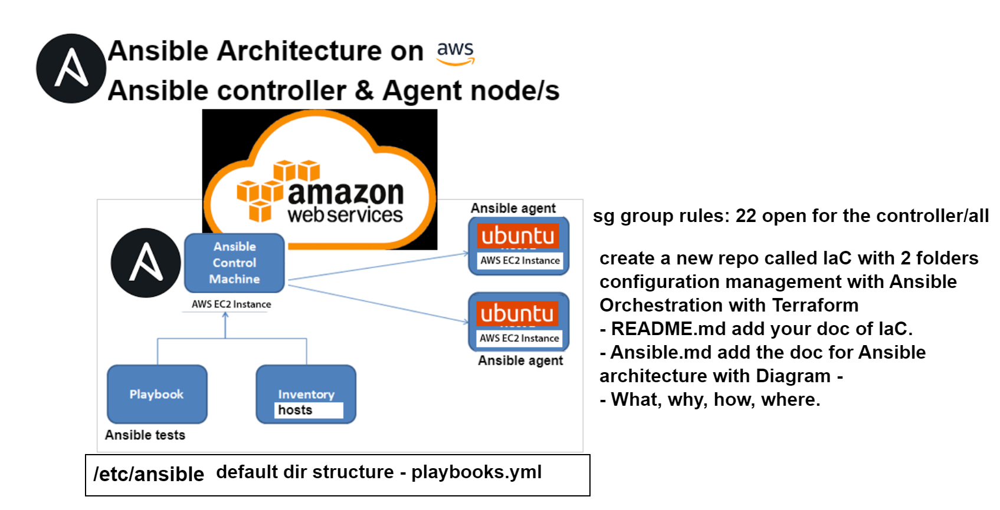

### What is Ansible?
Ansible is an open-source automation tool that is used to simplify configuration management.  

### Why do DevOps engineers use Ansible?
DevOps engineers use Ansible as it is an open source-tool that would automate tasks, thus embodying the DevOps culture of automation and efficiency.

Ansible offers this through its features, such as:
- Simplicity: YAML syntax allows for easy readability.
- Agentless: Eliminates the need for managing software client on target hosts, thus simplifying deployment and maintenance.
- Automating repetitive tasks: Ansible automates tasks such as software updates, allowing DevOps engineers to focus on higher-level activities, thus improving productivity and reducing human error.
- Integration: Ansible supports integration with cloud platforms such as AWS, Azure and GCP.

### How to use Ansible?
Ansible is used through playbooks. Each playbook contains one or more "plays". These plays would then have a number of variables:
- Name (simply detailing the name of that particular play)
- Hosts (which machines to target as detailed within the inventory file)
- Tasks (what to do to those particular machines)

The playbooks for Ansible describe what is to actually be done, in what order and to which targets.  
The inventory describes the who, whilst the playbooks describe the what.  
They are repeatable, re-usable and configurable in a vast number of ways and can be deployed over every machine that the inventory files describe and link to.

### Where would you use Ansible?
Ansible would be used throughout the Software Development Life Cycle. It would more commonly be used for:
- Configuration management:
  - Server configuration: Used to automate the configuration and setup of servers.
  - Application configuration: Can deploy and configure web servers and databases.
- Continuous Deployment:
  - Ansible can integrate with CI/CD pipelines to automate the deployment of applications and updates across different environments.

### How to setup Ansible:
1. To begin, we must create an EC2 instance named "Ansible_controller", as well as 2 more instances to represent both your app and your database.
2. From there, run the update and upgrade commands on all 3 instances.  
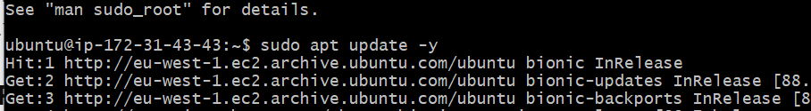  
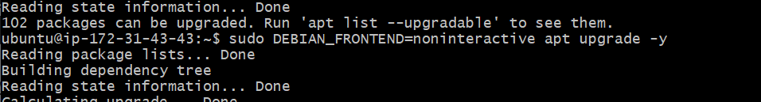
3. Once those commands are finished, we will run `sudo apt-get install software-properties-common` which ensures there are no updates that may have been bypassed.
   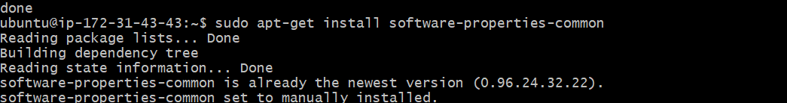
4. From there, we will install Ansible using the command `sudo apt-get install ansible -y`  
   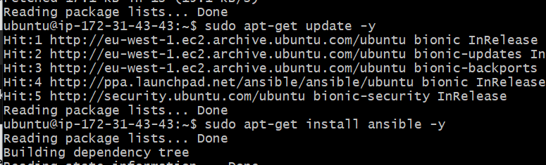
5. Verify Ansible has been correctly installed using `sudo ansible --version` 
   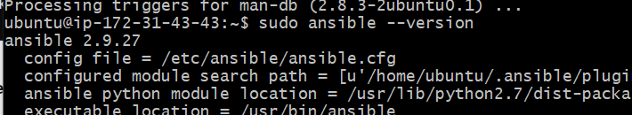
6. Next, we must use the `scp` command to securely transfer our private key from our local machine, to the ansible_controller virtual machine. This will then allow the ansible_controller VM to interact and access both the app and database VM, via SSH on GitBash. `scp -i ~/.ssh/tech258.pem -r ~/.ssh/tech258.pem ubuntu@ipaddress:~/.ssh`  
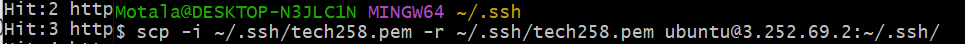
7. We must then provide the correct Read-Write-Execute permissions to the private key on our ansible_controller VM. In this instance, we wish to provide Read only hence the command `sudo chmod 400 tech258.pem`  
 
8. We must then configure the /etc/ansibe/hosts file in order for the ansible_controller to have the required information to communicate with the app and database VMs. The format is `IP address ansible_user=ubuntu ansible_ssh_private_key_file=/.ssh/tech258.pem ansible_port=22`.  
    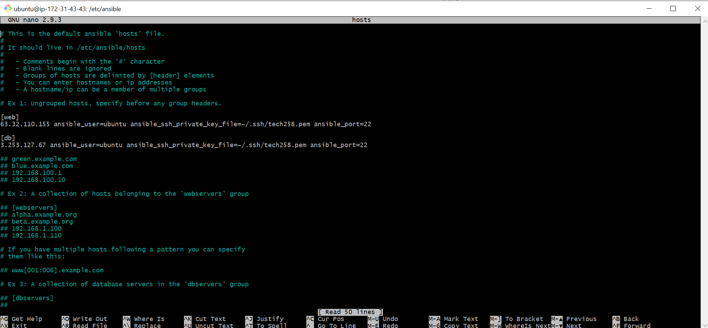
9. We would like to verify that this change has taken place through using the command `sudo ansible web -m ping` as this should return a `pong` response, if the controller is able to communicate with the app/database. 
      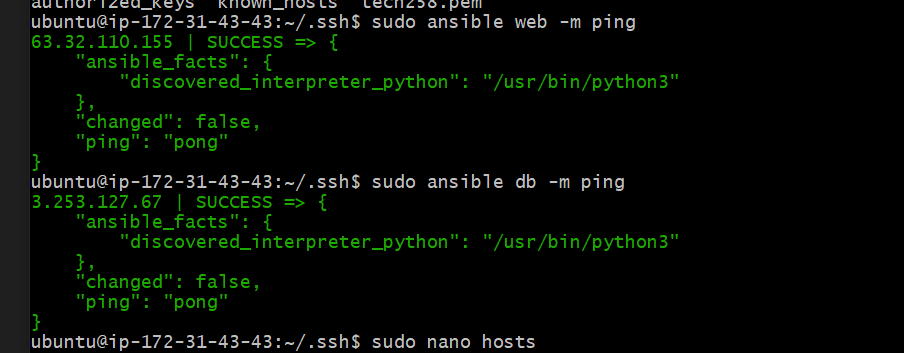
10. Create a text file using the command `sudo touch test-text.txt`.
11. Now to transfer this file from your ansible controller to the app and database vm, use the following command `sudo ansible all -m copy -a "src=/home/ubuntu/testing-controller.txt dest=/home/ubuntu/testing-controller.txt mode=0644 owner=ubuntu group=ubuntu"`
    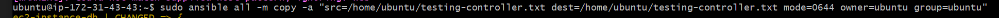
12. You can use the `sudo ansible web -a "ls"` command to see if the file has been transferred or not. 
 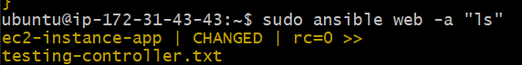
### AdHoc commands
To access the AdHoc commands, you can follow the following link: https://docs.ansible.com/ansible/latest/user_guide/intro_adhoc.html