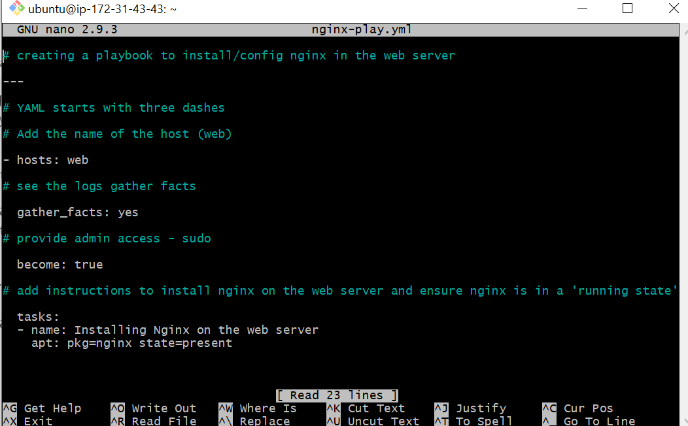
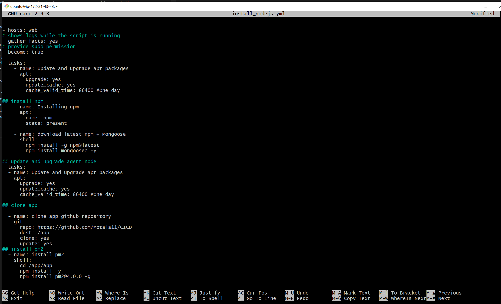
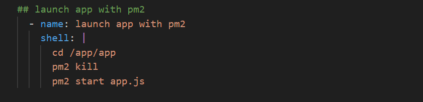

# How to install Nginx and NodeJS using Ansible playbooks

- [How to install Nginx and NodeJS using Ansible playbooks](#how-to-install-nginx-and-nodejs-using-ansible-playbooks)
    - [How to install Nginx](#how-to-install-nginx)
    - [How to install NodeJS](#how-to-install-nodejs)

Ansible is used through playbooks. Each playbook contains one or more "plays". These plays would then have a number of variables:
- Name (simply detailing the name of that particular play)
- Hosts (which machines to target as detailed within the inventory file)
- Tasks (what to do to those particular machines)

The playbooks for Ansible describe what is to actually be done, in what order and to which targets.  
The inventory describes the who, whilst the playbooks describe the what.  
They are repeatable, re-usable and configurable in a vast number of ways and can be deployed over every machine that the inventory files describe and link to.

### How to install Nginx
To install Nginx using an Ansible playbook, we must write a playbook. Playbooks are written in the language YAML, hence the file extension will end in `.yml`.

1. In order to write an Nginx playbook, we must use the command `sudo nano nginx-play.yml`. Here, we have named our file `nginx-play` as this is a clear name that will showcase what our file will actually do. 
2. It is best practice to make a guide throughout your file, to highlight each individual step that needs to occur.
3. The file must begin with `---` as this indicates the start of the file.
4. The first step is to name our host, so that it is clear on what VM we wish to make these changes. In our situation, it is the `web` host.
5. The next step is to ensure `gather_facts:` has been specified to `yes`. This is because we wish to receive the logs to collect the information that Ansible is receiving with our app VM.
6. Following on from this, we wish to provide admin access, hence the `become: true` line in our playbook. 
7. Next, we outline the task in the playbook. In this specific playbook, it will be installing Nginx.  
   To do this, we begin by specifiying `tasks:` whilst then assigning a name to the task, in this case it will be `Installing Nginx on the web server` (case insensitive), next we must specify what package we are wishing to install, which is `nginx`. We set `state=` to `present`, this ensures that the specified package is installed.

### How to install NodeJS
Now that we have installed Nginx, we wish to install NodeJS as well as migrating the code for our app to the App VM. We will create a playbook to automate these tasks for us:
1. In order to write an Nginx playbook, we must use the command `sudo nano install_nodejs.yml`. Here, we have named our file `install_nodejs` as this is a clear name that will showcase what our file will actually do. 
2. It is best practice to make a guide throughout your file, to highlight each individual step that needs to occur.
3. The file must begin with `---` as this indicates the start of the file.
4. The first step is to name our host, so that it is clear on what VM we wish to make these changes. In our situation, it is the `web` host.
5. The next step is to ensure `gather_facts:` has been specified to `yes`. This is because we wish to receive the logs to collect the information that Ansible is receiving with our app VM.
6. Following on from this, we wish to provide admin access, hence the `become: true` line in our playbook. 
7. Next, we will run `update` and `upgrade` to ensure the correct packages are available to us.
8. Subsequently, it is time to install NPM as well as Mongoose.
9. We will run `update` and `upgrade` once more to ensure we have the latest packages.
10. We will then migrate the app code via `git clone`.
11. Once the app code has been migrated, we will `cd /app/app` before installing pm2 in the `app` folder.
12. Finally, we will launch the app, with `pm2 start app.js`.

